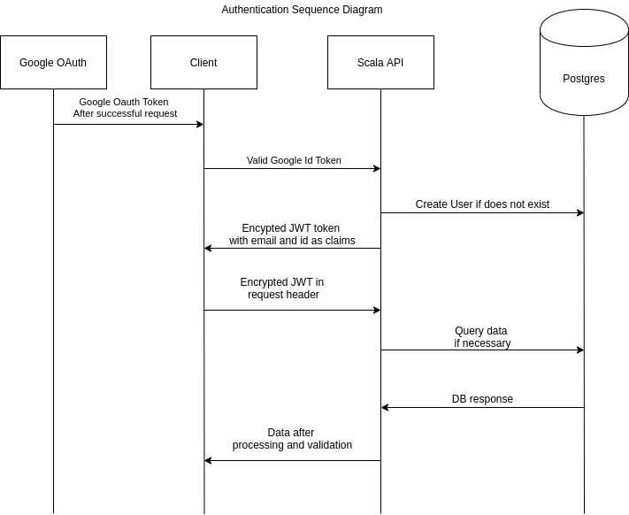

# Scala Api Implementation Documentation

## Project Structure:
* /main/scala:

    * /actor
        * Package which contains the akka actors used.
            * CyclaAdder Actor:
                * Used to periodically add new cycles to users in there end period. This means users will always have a prediciton of onje month forward.
    * /api 
        * Package which contains Routing configuration
            * Apis: UsersApi, MentrualApi, SharedUsersApi, TokenApi

    * /mappings
        * Package that contains necessary configuration for marshalling and unmarshalling of models from json to scala case classes or from scala case classes to json. 

    * /repositories 
        * Package that contains all the buisness logic of the application. It is incharge of communicationg with the db and send sql queries using slick.
            * GoogleSignIn : Implements the id_token verification process as seen in https://developers.google.com/identity/sign-in/web/backend-auth
            * TokenRepository : Methods for creating validating and passsing forward requests with valid Access-Token
            * /dao
                * Package with buisness logic the interacts with the database,  contains a method for each path in there respective api
                    * Menstrual Dao: 
                    * UserDao:  
                    * SharedUserDao
                    * BaseDao : implicit and configuration for all daos

        

    * /models 
        * Package that contains all models used for representing domain entities and for effective communication bodies.

        * /definition 
            * Contians necessary slick relational db definitions

        * Other packages contain models used for communication in there respective apis.

    * /utils
        * Package used for environment configurations:
            * DatabaseConfig: Slick configuration
            * JdbcUriConfig: Utility class to transform postgres DATABASE_URL format to valid jdbc url
            * LoggingConfig: Configure logging in application
            * MigrationConfig: Used to programaticallymigrate chagnes to db

    * Main 
        * Main entry point of the application.
        * inherits from Routes and configuration classes to have things ready. 

    * Routes
        * trait that incharge of building the whole application routes from the individual apis. 

* /main/resources 
    * /db/migration 
        * Holds all changes done to the database in form of versions.
        * Files have to be in sql
    * /public
        * Can be used to serve static content such as a landing page for advertisement purposes
    * application.conf
        * application configuration file which lets you control how much resources your server will use and how will individual services or libraries in your application behave. 

* /test/scala
    * Unit tests for all DAO objects in the project.
    * Missing unit testing routes using akka-http-testkit library


* build.sbt
    * Declares dependancies used in project

* Dockerfile
    * Dockerfile with specifications to build production image
    with the bare min necessary to start the server
* Dockerfile.dev
    * Dockerfile with specification to build development environment with sbt, java included

* project 
    * Directory that contains build properties such as sbt plugins.
        * Plugins used where:
            * Native Packager to compile program natively

## APIs

* Deployed URI: https://flovver-api.herokuapp.com
* All routes have as prefix /v1
* When a jwt token is expired or missing the server will respond with
    * 401 if expired
    * 403 if missing

### Token Api

* /token -> POST -> Given a valid google oauth id token provides a JWT token for future requests. View detailed diagram in /Documents/Diagrams
    * Request Body: 
    ```
    {
        "id_token":"valid id token"
    }
    ```
    * Responds with:
        * 200 if successful 
        * 400 if invalid id_token
    * Authorization token can be found in the header in Access-Token field 



### User Api (Authorization Key required)

* /user -> GET -> Gets the current user from the session
* /user/all -> GET -> Gets all users
* /user/{string} -> GET -> Searches for user with email like string

### Menstrual Info Api (Authorization Key Required)

* /menstrual/init -> POST -> Initializes the current account with first period information
    * Responds with status code 200
    * Request Body:
    ```
    {
        "bleed_start":"YYYY-MM-DD",
        "bleed_duration":#NumberInDays,
        "cycle_duration":#NumberInDays,
        "is_regular":BOOLEAN
    }
    ```
* /menstrual/add_period -> POST -> logs a new period to the database
    * Responds with status codes:
        * 200 if successful
        * 409 if bleed_start overlaps bleed_end or end_date
    * Request Body:
    ```
    {
        "bleed_start":"YYYY-MM-DD",
        "cycle_id":#ID of the cycle to change
    }
    ```
* /menstrual -> GET -> gets all cycles from current auth user

* /menstrual/update -> PUT -> updates the cycle given 
    * Responds with status codes:
        * 200 if successful
        * 409 if overlapping bleed_start, bleed_end or end_date
    * Request Body : 
    ```
    {
        "bleed_start":"YYYY-MM-DD",
        "bleed_end":"YYYY-MM-DD",
        "cycle_id":# ID number of intended 
    }
    ```

### Shared User Api Responds with updated lists 

* /shared_users/with_access -> GET -> Gets all users with access to your calendar
    * Responds with status codes:
        * 200 if successful
* /shared_users/accesible -> GET -> Gets all users which you can view there calendar
    * Responds with status codes:
        * 200 if successful
* /shared_users/add/{number} -> POST -> Adds user with id number
    * Responds with status codes:
        * 200 if successfult
        * 404 if not found
* /shared_users/revoke_me/{number} -> DELETE -> Revoke yourself from seeing another calendar
    * Responds with status codes:
        * 200 
        * 404
* /shared_users/revoke/{number} -> DELETE -> Revoke other user from seeing your calendar 
    * Responds with status codes:
        * 200
        * 404
* /shared_users/approve/{record_id} -> POST -> Approve a request to view another person's calendar with shared_user id {record_id}
    * Responds with starus codes:
        * 200
        * 404
* /shared_users/unapproved -> GET -> Gets all unapproved requests for you to view another persons' calendars
    * Responds with starus codes:
        * 200
        * 404